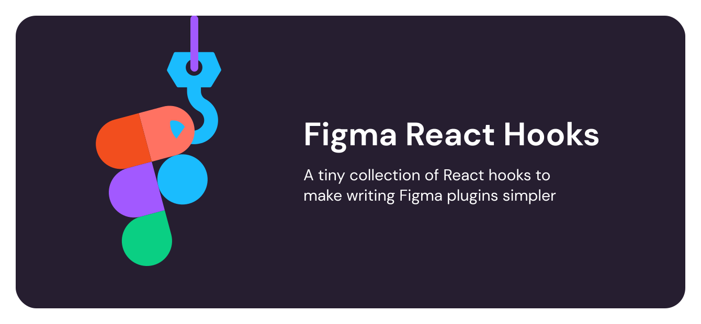

# Figma React Hooks



A tiny collection of React hooks to make writing Figma plugins simpler <sup>1</sup>.

_This tool is in currently in beta so please report any bugs or issues_ 🙏

## Install

To install simply run

```sh
npm i figma-react-hooks
```

---

## Usage

There are currently 2 hooks available in this library.

### useOnMessage

useOnMessage provides the behaviour for `window.onmessage` which allows the Figma plugin UI to recieve data from the core plugin code.

[Figma's `onmessage` documentation](https://www.figma.com/plugin-docs/api/properties/figma-ui-onmessage/)

The usage of this hook is somewhat similar to React's `useEffect` hook as it requires a function to be passed in as its first argument.

**Using inline function**

```javascript
import { useOnMessage } from 'figma-react-hooks';

useOnMessage((data) => {
  // Do something here
  console.log(data);
});
```

**Using a separate function**

```javascript
import { useOnMessage } from 'figma-react-hooks';

function anAwesomeFunction(data) {
  console.log(data);
}

useOnMessage((data) => anAwesomeFunction(data));
```

I will be adding the ability to pass nothing into `useOnMessage` and have it return the data as an object, rather than relying on passing in a function.

---

### usePostMessage

`usePostMessage(data: any, origin?: string)`

This hook replicates the behaviour of `postmessage` which allows the plugin UI to send data back to the core plugin code.

[Figma's `postmessage` documentation](https://www.figma.com/plugin-docs/api/properties/figma-ui-postmessage/)

It takes in an object and optionally, a string to set the origin.

| Parameter | Type     | Required | Description                                                                                                                                                                                                                                                              |
| --------- | -------- | -------- | ------------------------------------------------------------------------------------------------------------------------------------------------------------------------------------------------------------------------------------------------------------------------ |
| data      | `any`    | `true`   | This is the data you want to send back to the core plugin code. This can be almost any data type or plain object, as long as it's a serializable object. [Read more about the restrictions here](https://www.figma.com/plugin-docs/api/properties/figma-ui-postmessage/) |
| origin    | `string` | `false`  | If you don't provide a specific origin, it will default to `'*'` which is what Figma recommends as a default. For more information on the origin property read [Figma's API documentation](https://www.figma.com/plugin-docs/api/properties/figma-ui-postmessage/).      |

**Example**

```javascript
import { usePostMessage } from 'figma-react-hooks';

let data = { animal: 'dog', vibe: 'chill' };

function onSubmit(data) {
  usePostMessage(data);
}
```

## To do

- Add better error and exception handling to existing hooks
- Add in hook for Figma's `on` function
- Improve useOnMessage hook to allow more use cases

---

<sup>1</sup> Note: I am not affiliated with Figma, I just ❤️ the tool.
